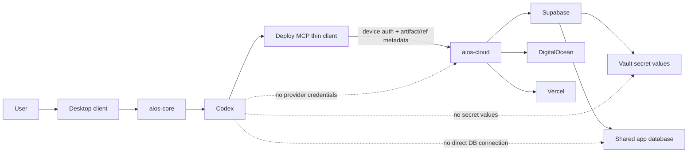

# Cloud deployment implementation plan

## Goal

Replace device-owned deployment with a cloud control plane. Codex continues to call one
local `deploy` MCP server, but that server is a thin client. Provider credentials, user
secret values, authorization, builds, database access, and provider API calls live in
`aios-cloud`.

The production deployment interfaces exposed to Codex are:

- `deploy_database` — provisions and migrates an app schema in the shared Supabase project.
- `deploy_server` — deploys an independent App Platform app into the shared DigitalOcean
  Project.
- `deploy_frontend` — deploys the frontend as its own Vercel Project.

The same MCP server also exposes cloud-mediated, read-only database inspection tools.

## Locked product decisions

- There is one live deployment context. AIOS does not model development, preview, staging,
  or production environments.
- Deployments are still immutable, versioned releases so an application version can be
  superseded or rolled back without introducing an environment model.
- Provider tokens and all calls to Supabase, DigitalOcean, and Vercel live in `aios-cloud`.
  They are never stored on or returned to the user-facing device.
- User-provided secrets live encrypted in Supabase Vault. The device and Codex see secret
  IDs, requirements, binding metadata, and configured status, but never secret values.
- All application databases share one Supabase project. Each AIOS app receives an opaque,
  dedicated Postgres schema and app-scoped roles.
- Codex may inspect production rows when the cloud policy permits access to that specific
  table. Every read goes through `aios-cloud`; Codex never receives direct database
  credentials.
- Codex database access is read-only. Schema changes go through versioned migrations.
  Direct corrective production writes are not part of the first implementation.
- Supabase Auth is shared. App membership is represented explicitly and enforced by RLS.
- Supabase Storage uses app-scoped private buckets and RLS policies.
- Each frontend app maps to one Vercel Project. Vercel owns generated domains, DNS, and TLS.
- All backend apps live in one DigitalOcean Project. Each backend is a separate App Platform
  app with its own settings and resource limits.
- Users interact with provider resources through AIOS. They do not receive membership or
  provider-console credentials for the shared AIOS provider accounts.
- Per-app recovery and per-app backup/restore workflows are out of scope for this plan.

## Trust boundary



## Provider resource mapping

| AIOS object | Provider object |
| --- | --- |
| Cloud database estate | One Supabase project |
| App database | One opaque Postgres schema |
| App database runtime | One schema-restricted Postgres role |
| App file storage | One private Supabase Storage bucket |
| Backend app | One DigitalOcean App Platform app |
| Backend estate | One DigitalOcean Project |
| Frontend app | One Vercel Project |
| Frontend release | One Vercel deployment |

All provider IDs are stored in the cloud resource registry. Provider responses and IDs are
normalized before they are returned to the MCP client.

## Local artifact contract

An app directory contains source, non-secret metadata, and secret references only:

```text
apps/<app-id>/
├── aios.deploy.yaml
├── .env.example
├── database/
│   └── migrations/
├── server/
│   ├── Dockerfile
│   └── ...
└── frontend/
    └── ...
```

Example manifest:

```yaml
version: 1
app_id: app_01j...

database:
  migrations: database/migrations
  required_extensions: []

server:
  source: server
  health_path: /health
  secrets:
    - env: OPENAI_API_KEY
      secret_ref: sec_01j...
      exposure: runtime

frontend:
  source: frontend
  public_config:
    - env: NEXT_PUBLIC_SUPABASE_URL
      config_ref: supabase_url
```

Rules:

- `.env.example` contains empty placeholders only.
- Dockerfiles must not contain secret values or secret `ARG` instructions. Empty `ENV`
  stubs are permitted; cloud-side provider injection supplies values only at runtime.
- Artifacts identify secrets by stable cloud ID; they do not contain ciphertext.
- Artifact upload rejects `.env`, private keys, credentials, and known token patterns.
- Every uploaded artifact is immutable and addressed by SHA-256.

## Deploy MCP interface

The MCP server in `mini-aios` packages and uploads artifacts, starts jobs, polls or streams
events, and returns normalized results. It performs no provider call and resolves no secret.

### Deployment tools

```text
deploy_database()
deploy_server()
deploy_frontend()
get_app_info(app_id)
```

The thin client derives `app_id` from `aios.deploy.yaml`, creates the immutable artifact,
uploads it, and passes the resulting `artifact_id` to the authenticated cloud API.
`get_app_info` returns the app record plus each component's active production URL
and latest deployment status, allowing Codex to rediscover endpoints across sessions.

Each call returns a cloud deployment job:

```json
{
  "deployment_id": "dep_01j...",
  "status": "queued",
  "component": "server"
}
```

### Database inspection tools

```text
list_database_tables(app_id)
inspect_database_table(app_id, table)
query_database_table(app_id, table, select, filters, order, limit)
list_database_migrations(app_id)
```

The first version accepts structured queries rather than arbitrary SQL. Joins and aggregates
can be added deliberately later without exposing a general SQL execution channel.

## Cloud API

Implement under `/Users/suneetpathangay/aios-cloud/app/routes/` using the existing user and
device authentication dependencies.

### Apps and artifacts

```http
POST /v1/apps
GET  /v1/apps/{app_id}
DELETE /v1/apps/{app_id}

POST /v1/artifacts/uploads
POST /v1/artifacts/{artifact_id}/complete
GET  /v1/artifacts/{artifact_id}
```

Artifact completion validates size, content hash, manifest schema, app ownership, and secret
scanning results before marking the artifact deployable.

### Deployments

```http
POST /v1/apps/{app_id}/deployments/database
POST /v1/apps/{app_id}/deployments/server
POST /v1/apps/{app_id}/deployments/frontend

GET  /v1/deployments/{deployment_id}
GET  /v1/deployments/{deployment_id}/events
POST /v1/deployments/{deployment_id}/confirm
POST /v1/deployments/{deployment_id}/cancel
POST /v1/deployments/{deployment_id}/rollback
```

Mutating requests require an idempotency key. Retrying a request must return the existing job
instead of creating a duplicate provider resource.

### Secrets

User-authenticated endpoints:

```http
POST   /v1/secrets
GET    /v1/secrets
GET    /v1/secrets/{secret_id}
PUT    /v1/secrets/{secret_id}
DELETE /v1/secrets/{secret_id}

PUT /v1/apps/{app_id}/secret-bindings
GET /v1/apps/{app_id}/secret-bindings
```

No endpoint returns a secret value. List and get endpoints return metadata and configured
status only. Deploy-device authentication may inspect bindings for its owned app but may not
create, rotate, reveal, or delete user secrets.

### Database gateway

```http
GET  /v1/apps/{app_id}/database/tables
GET  /v1/apps/{app_id}/database/tables/{table}
POST /v1/apps/{app_id}/database/tables/{table}/query
GET  /v1/apps/{app_id}/database/migrations
```

Each call checks user/device ownership, app ownership, and the table's Codex access policy
before touching Supabase.

## Cloud data model

Add equivalent SQLAlchemy models and Supabase migrations for:

```text
apps
  id, owner_id, name, status, created_at, deleted_at

artifacts
  id, app_id, sha256, size, manifest, storage_key, status, created_at

deployments
  id, app_id, artifact_id, component, status, active, provider_resource_id,
  provider_deployment_id, url, error_code, attempt_count, lease_owner,
  lease_expires_at, next_attempt_at, created_at, updated_at

deployment_events
  id, deployment_id, sequence, kind, payload, created_at

provider_resources
  id, app_id, provider, resource_type, provider_id, state, metadata

user_secrets
  id, owner_id, kind, label, vault_secret_id, version, created_at, rotated_at

app_secret_bindings
  id, app_id, target, env_name, secret_id, exposure  # runtime | build

app_database_resources
  app_id, schema_name, runtime_role, reader_role, migration_version

app_tables
  id, app_id, schema_name, table_name, codex_readable, max_rows_per_query,
  protected_columns, created_by_migration_id

app_migrations
  id, app_id, version, name, checksum, sql, artifact_id, applied_at

app_memberships
  app_id, auth_user_id, role

secret_access_events
  id, secret_id, app_id, deployment_id, provider, action, created_at
```

Provider tokens remain cloud configuration and are not rows in `user_secrets`.

## Secret resolution and injection

1. A user sends a new secret value directly to `aios-cloud` over authenticated TLS.
2. The cloud writes the value to Supabase Vault and stores only its Vault ID in
   `user_secrets`.
3. An artifact contains an app binding to the cloud secret ID.
4. Deployment preflight validates secret ownership, target, exposure, and presence.
5. The worker resolves the value just in time and writes it to the provider's secret-variable
   interface.
6. The value is never placed in deployment events, logs, artifacts, API responses, or the
   device workspace.

Default policy is runtime-only injection. Frontend variables with browser-visible prefixes
such as `NEXT_PUBLIC_` or `VITE_` are public configuration, not secrets, and must be explicitly
classified as public. Build-time secret injection requires an explicit allowlist.

Missing bindings produce a resumable response rather than a generic error:

```json
{
  "status": "action_required",
  "reason": "missing_secrets",
  "missing": [
    {"env": "OPENAI_API_KEY", "kind": "openai_api_key", "target": "server"}
  ]
}
```

The desktop collects or selects the secret, saves it to the cloud, and resumes the same job.

## Shared Supabase isolation

For each app, `deploy_database` provisions opaque identifiers such as:

```text
schema:        app_a71f9c
runtime role:  app_a71f9c_runtime
reader role:   app_a71f9c_reader
```

- The runtime role is granted only the operations required by the deployed application on
  its schema.
- The reader role receives `SELECT` only on tables whose cloud policy permits Codex reads.
- Role credentials are generated by the cloud, stored in Vault, and injected only into the
  matching backend.
- No generated app receives the project `service_role` key or the project Postgres password.
- Browser clients use the publishable key, the signed-in user's JWT, app membership checks,
  and RLS.
- Migrations execute using a privileged cloud-only connection after validation.
- Migration SQL must use the assigned schema and cannot modify `auth`, `vault`,
  `aios_control`, another app schema, roles, or project configuration.
- Required extensions are declarations. The cloud installs only allowlisted extensions and
  treats them as shared project resources.

## Codex production-data reads

Codex may read production rows only through the cloud gateway. A query is executed in a
read-only transaction using the app reader role and receives:

- a short statement timeout;
- an enforced row and response-size limit;
- an app-scoped `search_path`;
- protected-column removal;
- table-level authorization;
- an immutable audit event.

Example table policy:

```yaml
table: customers
codex_readable: true
max_rows_per_query: 100
protected_columns:
  - password_hash
  - payment_token
```

`inspect_database_table` returns columns, constraints, indexes, an estimated row count, and
the migrations that affected the table. Migration history includes exact SQL, checksum,
artifact, and applied timestamp and is not editable by Codex.

## Shared Auth and Storage

- Supabase Auth identities are project-wide.
- App authorization is represented by `app_memberships(app_id, auth_user_id, role)`.
- Exposed app tables enable RLS and verify both the end-user identity and app membership.
- Storage creates one private bucket per app using opaque names.
- Storage object policies scope access by bucket, app membership, and object owner.
- Deployed applications never receive the Storage service key, because it bypasses RLS.

Shared Auth configuration is an accepted MVP constraint. App-specific OAuth branding, email
templates, and independent Auth configuration are not included in this plan.

## Deployment state machine

```text
queued
  -> validating
  -> awaiting_secrets | awaiting_confirmation
  -> provisioning
  -> building
  -> deploying
  -> health_checking
  -> active
  -> failed | cancelled | rolled_back | superseded
```

- State transitions are persisted before external calls.
- Provider operations use stable idempotency keys and resource tags.
- Workers may safely retry after process restart.
- Only one mutating deployment per app component runs at a time.
- A new release becomes active only after provider success and health checks.
- Deployment events are cursor-addressable so the desktop and Codex can reconnect without
  losing progress or duplicating questions.

## Provider adapters

Keep provider details behind a common internal interface in `aios-cloud`:

```text
app/deploy/providers/base.py
app/deploy/providers/supabase.py
app/deploy/providers/digitalocean.py
app/deploy/providers/vercel.py
```

### Supabase adapter

- Creates app schema, roles, grants, RLS scaffolding, memberships, and Storage bucket.
- Applies validated, checksummed migrations serially.
- Records live schema objects and migration-to-table relationships.
- Uses Supabase MCP or supported management/database APIs only from the cloud worker.

### DigitalOcean adapter

- Creates one App Platform app for each AIOS backend under the shared DigitalOcean Project.
- Uses unique AIOS resource tags and stores the returned app ID.
- Configures encrypted runtime variables, health checks, resource sizing, and connection
  limits.
- Does not grant users access to the shared DigitalOcean account or Project.

### Vercel adapter

- Creates one Vercel Project for each AIOS frontend app.
- Uploads or links the immutable artifact and creates a deployment.
- Adds server-only values as sensitive variables and public configuration separately.
- Returns the Vercel-managed URL. Domain, DNS, and TLS operations remain Vercel's
  responsibility.

## Limits and tenant safety

Enforce cloud-side limits before provider calls:

- apps per user;
- concurrent deployments per user and per provider;
- artifact size and file count;
- DigitalOcean instance size and container count;
- Vercel project count;
- database schema size and table count;
- Postgres role connection limit;
- migration and Codex query timeouts;
- Codex query rows and response bytes;
- Storage bytes and object count;
- user and app deployment rate limits.

Generated code is untrusted. Secrets are not available during builds by default, logs are
redacted, provider responses are sanitized, and generated applications cannot reach the
cloud control-plane database with privileged credentials.

## Deletion and reconciliation

App deletion is asynchronous and retryable:

```text
disable traffic
-> delete Vercel Project
-> delete DigitalOcean App
-> revoke app database roles
-> remove app schema
-> remove app Storage buckets
-> delete secret bindings
-> retain a non-secret audit tombstone
```

A periodic reconciler compares the cloud resource registry with all three providers, repairs
stale status, and queues cleanup for orphaned resources. User secrets are not deleted merely
because one app binding is removed; explicit secret deletion remains a user operation.

## Implementation phases

### Phase 1 — contracts and persistence

- Add versioned Pydantic request/response contracts to `aios-cloud`.
- Add app, artifact, deployment, provider resource, secret metadata/binding, database,
  migration, membership, and audit migrations/models.
- Add ownership policies and authorization tests.
- Define `aios.deploy.yaml` and artifact validation in `mini-aios`.

### Phase 2 — cloud job engine and local MCP client

- Implement persisted deployment jobs, events, idempotency, locking, cancellation, and
  restart-safe workers.
- Add artifact upload and content-addressed storage.
- Replace the local deploy MCP implementation with the three cloud-backed deployment tools.
- Integrate `action_required` with the existing Codex question/resume flow.

### Phase 3 — secrets

- Add user secret CRUD through Supabase Vault without any read-value endpoint.
- Add app bindings, preflight validation, audit events, rotation/version tracking, and
  provider injection.
- Add artifact and log secret scanners/redactors.

### Phase 4 — database and data gateway

- Provision app schemas, app runtime/reader roles, grants, RLS, memberships, and Storage
  buckets.
- Add migration validation, serialization, checksums, history, and extension allowlisting.
- Add table discovery, inspection, migration listing, and structured production-row queries.
- Enforce table policies, protected columns, limits, read-only transactions, and auditing.

### Phase 5 — frontend deployment

- Implement Vercel Project creation and deployment.
- Inject sensitive server variables and separate public configuration.
- Persist URLs/provider mappings and stream provider status to deployment events.

### Phase 6 — server deployment

- [x] Finalize the immutable cloud build/source transport path.
- [x] Implement DigitalOcean App Platform app creation inside the shared Project.
- [x] Inject the app-scoped database connection and other runtime secrets.
- [x] Add resource sizing, health checks, activation, logs, and failure normalization.

### Phase 7 — lifecycle and hardening

- [x] Add rollback, deletion, provider reconciliation, quotas, cost controls, and provider
  webhook verification.
- [ ] Connect the aggregate operations endpoint to dashboards/alerts for stuck jobs,
  provider errors, secret-access failures, capacity,
  and tenant limit violations.
- [x] Remove or disable the production path through the legacy local Docker supervisor.

## Test and acceptance contract

The implementation is complete when automated tests prove:

- no provider or user secret is persisted or returned by `mini-aios`;
- no secret value appears in an artifact, event, API response, or captured log;
- duplicate deployment requests create one provider resource;
- jobs resume correctly after a cloud worker restart;
- one app cannot query, migrate, connect to, or inspect another app's schema;
- Codex can inspect an allowed production table and its migration history through the cloud;
- denied tables and protected columns remain unavailable to Codex;
- a deployed backend has only its app-specific database privileges;
- frontend users are isolated by app membership and RLS;
- Storage objects are isolated by app bucket, membership, and owner;
- frontend, server, and database deployments succeed through their real provider adapters in
  an opt-in live end-to-end suite;
- cancellation, partial provider failure, deletion retry, and reconciliation are idempotent;
- the desktop can collect a missing secret and resume the same deployment job.

Tests must not mock the unit under test in provider contract or live end-to-end suites. Unit
tests may mock provider HTTP boundaries, while live suites must exercise real provider APIs
against explicitly designated test resources.

## Explicit non-goals

- Per-app backup, restore, or disaster-recovery automation.
- Multiple AIOS deployment environments.
- Direct provider-console access for users.
- Direct Codex database credentials or arbitrary SQL execution.
- Codex production data mutation outside versioned migrations.
- Independent Supabase Auth configuration per generated app.
- Device-side provider calls, provider tokens, or user secret values.

## Implementation progress

- [x] Added the initial `aios-cloud` control-plane schema for apps, artifacts, deployments,
  provider resources, secret metadata/bindings, app database metadata, migrations, table
  policies, memberships, and audit events. Production tables have RLS enabled with no public
  Data API policies; local SQLite mirrors the schema for tests.
- [x] Added ownership-scoped app create/list/get/delete APIs using the existing paired-device
  authentication boundary.
- [x] Added persistence primitives for content-addressed artifact registration and
  concurrency-safe, idempotent deployment creation with an initial event.
- [x] Added the versioned `aios.deploy.yaml` parser, component/path validation, secret-reference
  contract, credential-file scanning, artifact limits, and deterministic artifact hashing in
  `mini-aios`.
- [x] Added deterministic `tar.gz` artifact creation (including the declared Dockerfile),
  private Supabase Storage signed upload, independent cloud-side hash/size/archive/manifest
  verification, and artifact upload/complete/get APIs.
- [x] Added deployment enqueue/status/event/cancel/resume APIs and a restart-safe worker
  engine with atomic claims, expiring leases, stale-worker rejection, persisted retries,
  progress events, and action-required states.
- [x] Added the three cloud-backed deploy MCP tools and main-agent cloud app reservation.
  The legacy local tool remains compatibility-only until the Phase 7 removal gate.
- [x] Added Codex-facing deployment status/event/cancel/resume MCP tools and explicit
  nonterminal polling guidance. Action-required states now remain durable cloud states
  instead of falling back to stdin.
- [x] Added user-authenticated Vault secret create/list/get/rotate/delete endpoints,
  device-readable metadata-only references, per-app bindings, internal resolution,
  redaction, rotation/version tracking, and secret-access auditing. No read-value endpoint
  exists.
- [x] Added the DigitalOcean server executor: server-only artifact extraction, Dockerfile
  boundary validation, a minimal-environment Buildx push to DOCR, immutable digest-based
  App Platform specs, stable per-app resource recovery, Project assignment, provider
  polling/cancellation, safe failure summaries, external health verification, and persisted
  provider IDs/URLs. User secrets and the Vault-held app runtime `DATABASE_URL` are injected
  only as App Platform runtime secrets; database-credential access is independently audited.
- [x] Added Phase 7 lifecycle hardening: immutable frontend/server rollback jobs, leased
  idempotent app cleanup across DigitalOcean, DOCR, Vercel, Supabase schemas/roles/Vault,
  app Storage, and artifact Storage; late-resource orphan protection; periodic provider
  reconciliation; per-user app/concurrency/hourly and artifact-size quotas; fixed
  administrator-owned server sizing; signed/idempotent Vercel webhook ingestion; and a
  token-protected PII-free operations health snapshot. The legacy local deploy tool is
  disabled by default, while cloud rollback/delete tools live on the deploy MCP server.
- [x] Added the Supabase database executor: opaque per-app schemas, separate non-login
  migration/reader roles, a login-limited runtime role whose URL is stored only in Vault,
  extension allowlisting, advisory-lock serialization, immutable checksummed migrations,
  RLS/grant synchronization, app membership metadata, and private per-app Storage buckets.
- [x] Added the cloud database gateway and Codex MCP tools for table listing, inspection,
  exact migration history, and structured production-row reads. Reads use a no-login role,
  read-only transactions, fixed search paths, statement/row/response limits, column-level
  grants, protected-column rejection, ownership checks, and immutable audit events.
- [x] Added the Vercel frontend executor: one stable opaque Project per AIOS app, isolated
  frontend extraction from the verified artifact, package/framework detection, SHA-addressed
  file upload, production deployments, restart-safe metadata reuse, provider polling,
  health checks, normalized errors, and persisted provider IDs/URLs. User values are synced
  as Vercel sensitive variables; allowlisted public configuration is kept separate; removed
  bindings are deleted; browser-exposed secret prefixes are rejected.
- [ ] Validate database provisioning against a designated live Supabase test project and
  finalize browser-facing Data API exposure for dynamic app schemas before production use.
