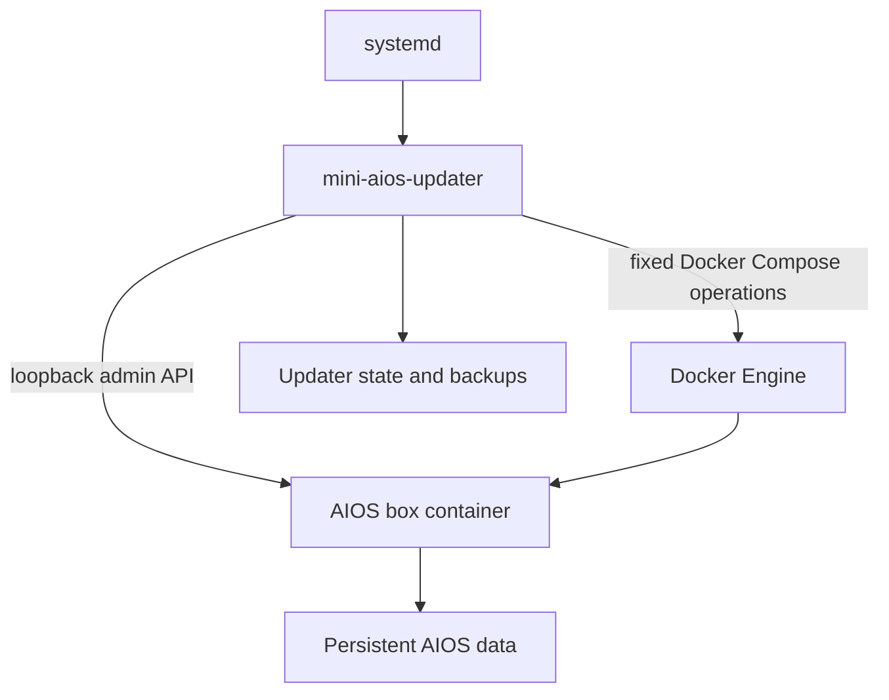

# Mini AIOS host updater definition

Status: proposed implementation contract
Component name: `mini-aios-updater`
Production platforms: `linux/amd64` and `linux/arm64`
Development test platforms: `darwin/amd64` and `darwin/arm64`

## 1. What the host updater is

The host updater is a small native Linux program installed on the appliance outside the AIOS Docker container. It is the trusted supervisor that downloads, verifies, activates, observes, and rolls back AIOS releases.

It is not:

- part of the AI agent;
- a Python module imported by the AIOS application;
- a container with the Docker socket mounted into it;
- a general remote-command service;
- an operating-system or firmware updater; or
- a replacement for Docker Engine.

The separation matters because the program being replaced cannot reliably supervise its own replacement. It also prevents an AIOS agent or compromised application process from inheriting update authority.

## 2. Linux build targets

Build the updater as a statically linked Go executable:

```text
mini-aios-updater_<version>_linux_amd64.tar.gz
mini-aios-updater_<version>_linux_arm64.tar.gz
```

Recommended Go build settings:

```text
CGO_ENABLED=0 GOOS=linux GOARCH=amd64
CGO_ENABLED=0 GOOS=linux GOARCH=arm64
```

The AIOS application image is also published for:

```text
linux/amd64
linux/arm64
```

Those variants are combined into one OCI multi-platform image index in GHCR. Docker selects the matching variant on the appliance, while the updater verifies that the signed release supports the detected platform.

Linux is the production host target because the appliance deployment uses Docker, Linux filesystem ownership, Unix sockets, and `systemd`. macOS is a supported development/test host: the native Mac updater drives Linux AIOS containers through Docker Desktop and can exercise the complete update transaction. It runs as the logged-in user or a LaunchAgent and is not treated as an appliance deployment.

## 3. Runtime ownership

The updater runs as a root-owned `systemd` service because control of Docker is effectively root-equivalent. The AIOS application container does not receive the Docker socket or updater credentials.



Privileges are constrained even though the service is root:

- no network listener;
- root-only Unix control socket;
- read-only access to installed Compose configuration;
- write access only to updater state, release pointer, backup, and AIOS database paths;
- no shell evaluation;
- fixed executable paths and argument arrays for Docker operations; and
- no environment-variable or path values accepted from a release manifest as commands.

## 4. Installed files

```text
/usr/local/bin/mini-aios-updater
/etc/systemd/system/mini-aios-updater.service
/etc/mini-aios/updater.toml
/etc/mini-aios/trusted-root.json
/etc/mini-aios/updater-admin-token
/opt/mini-aios/compose.yaml
/opt/mini-aios/release.env
/run/mini-aios-updater/control.sock
/var/lib/mini-aios-updater/state.json
/var/lib/mini-aios-updater/journal.jsonl
/var/lib/mini-aios-updater/update.lock
/var/lib/mini-aios-updater/credentials.json
/var/lib/mini-aios-updater/metadata/
/var/lib/mini-aios-updater/backups/
/var/lib/mini-aios/state/aios.db
/var/lib/mini-aios/projects/
/var/lib/mini-aios/sessions/
/var/lib/mini-aios/uploads/
/var/lib/mini-aios/artifacts/
/var/lib/mini-aios/runs/
/var/lib/mini-aios/skills/
/var/lib/mini-aios/memories/
/var/lib/mini-aios/deployments/
```

`/var/lib/mini-aios` is mounted at `/root/.mini-aios` in the box container, so
these are the same directories described by the production
[`~/.mini-aios` storage contract](./storage-layout.md), not a second copy.

Permissions:

| Path | Owner/mode | Purpose |
|---|---|---|
| updater binary/config/root | `root:root`, not group-writable | Trusted program and policy |
| credentials/admin token | `root:root`, `0600` | Device and loopback credentials |
| updater state/backups | `root:root`, `0700` directory | Transaction state and recovery data |
| control socket | `root:root`, `0600` | Local administrative commands |
| Compose/release files | `root:root`, not group-writable | Fixed service definition and selected digest |
| AIOS data | dedicated runtime ownership | Persistent application state |

The updater rejects symlinks for security-sensitive files and verifies that resolved paths remain within their configured roots.

## 5. Process modes and CLI

One binary provides a daemon and root-only local client:

```text
mini-aios-updater daemon
mini-aios-updater status [--json]
mini-aios-updater check
mini-aios-updater bootstrap
mini-aios-updater install <release-id>
mini-aios-updater rollback
mini-aios-updater doctor [--json]
mini-aios-updater version
```

`daemon` is the only mode that mutates update state automatically. Other mutating commands send a typed request over `/run/mini-aios-updater/control.sock`; they do not start a second update engine.

`bootstrap` is restricted to a device with no selected release and performs the initial signed activation without a drain or rollback backup. `install` is used thereafter and retains the full drain, backup, observation, and rollback transaction. Neither command accepts an image URL, tag, digest, shell command, or arbitrary manifest path from the caller.

`rollback` selects only the recorded previous release and verifies database compatibility. A normal caller cannot reset the monotonic release sequence.

## 6. Configuration

Example `/etc/mini-aios/updater.toml`:

```toml
channel = "stable"
control_plane_url = "https://computer.trywink.io"
tuf_metadata_url = "https://updates.trywink.io/tuf/metadata/"
tuf_targets_url = "https://updates.trywink.io/tuf/targets/"
compose_project_dir = "/opt/mini-aios"
compose_service = "box"
aios_data_dir = "/var/lib/mini-aios"
database_relative_path = "state/aios.db"
state_dir = "/var/lib/mini-aios-updater"

poll_interval = "30m"
poll_jitter = "30m"
maintenance_window_start = "02:00"
maintenance_window_duration = "4h"
minimum_free_bytes = 2147483648
backup_retention = 2

drain_timeout = "5m"
startup_timeout = "2m"
observation_period = "5m"
health_interval = "5s"
health_failure_limit = 3
```

The file contains policy but no secrets. `/var/lib/mini-aios-updater/credentials.json` holds the per-device assignment credential. `/etc/mini-aios/updater-admin-token` authenticates only the loopback drain/readiness API.

Release metadata may make timeouts stricter for a release but may not expand local maximums beyond administrator-configured safety limits.

## 7. systemd contract

Conceptual unit:

```ini
[Unit]
Description=Mini AIOS Host Updater
After=network-online.target docker.service
Wants=network-online.target
Requires=docker.service

[Service]
Type=notify
ExecStart=/usr/local/bin/mini-aios-updater daemon --config /etc/mini-aios/updater.toml
Restart=on-failure
RestartSec=10s
UMask=0077
NoNewPrivileges=true
PrivateTmp=true
ProtectHome=true
ProtectSystem=strict
ReadWritePaths=/opt/mini-aios /var/lib/mini-aios /var/lib/mini-aios-updater /run/mini-aios-updater

[Install]
WantedBy=multi-user.target
```

The exact hardening flags must be tested against the appliance's Docker setup. Docker-socket access remains a powerful capability even when filesystem access is constrained.

The daemon reports ready to `systemd` only after:

1. configuration and trusted root parse successfully;
2. state and journal can be read;
3. unfinished update recovery has been evaluated;
4. Docker is reachable; and
5. the local control socket is listening.

An unavailable update server does not fail daemon readiness and does not stop the currently installed AIOS release.

## 8. Internal modules

The Go implementation is divided into narrow packages:

```text
cmd/mini-aios-updater     daemon and CLI entrypoint
internal/config           strict TOML parsing and limits
internal/platform         architecture, power, disk, and clock checks
internal/tuf              go-tuf client and trusted metadata store
internal/assignment       control-plane client and offline event queue
internal/registry         immutable image pull and digest inspection
internal/aios             drain, resume, and readiness client
internal/backup           SQLite backup, hashing, fsync, and restore
internal/activation       release.env and fixed Compose operations
internal/health           startup and observation gates
internal/state            durable state machine, lock, and journal
internal/control          root-only Unix socket protocol
internal/redact           bounded structured error reporting
```

Network clients have explicit response-size limits, timeouts, TLS verification, and bounded redirects. Metadata, assignment responses, health responses, and Docker inspection output are decoded with strict schemas.

## 9. Durable state

`state.json` is atomically written and fsynced before every side effect:

```json
{
  "formatVersion": 1,
  "state": "observing",
  "attempt": 1,
  "releaseId": "2026.08.10.1",
  "from": {
    "releaseId": "2026.07.31.2",
    "sequence": 42,
    "image": "ghcr.io/mahithsc/mini-aios@sha256:...",
    "databaseSchema": 2
  },
  "to": {
    "releaseId": "2026.08.10.1",
    "sequence": 43,
    "image": "ghcr.io/mahithsc/mini-aios@sha256:...",
    "databaseSchema": 3
  },
  "backupPath": "/var/lib/mini-aios-updater/backups/2026.08.10.1/aios.db",
  "transitionedAt": "2026-08-10T20:15:00Z"
}
```

Allowed states:

```text
idle
checking
downloading
preflight
awaiting_window
draining
backing_up
activating
observing
committed
rolling_back
rolled_back
failed
recovery_required
```

The updater uses a non-blocking kernel file lock so reboots, timers, and manual commands cannot create concurrent update attempts.

## 10. Docker activation contract

The installed Compose file contains the service topology. The updater changes only the root-owned `release.env` values:

```dotenv
AIOS_IMAGE=ghcr.io/mahithsc/mini-aios@sha256:<verified-digest>
AIOS_RELEASE_ID=2026.08.10.1
```

Activation invokes Docker Compose with a fixed argument vector equivalent to:

```text
/usr/bin/docker compose
  --project-directory /opt/mini-aios
  --env-file /opt/mini-aios/release.env
  up -d --no-build --no-deps box
```

No value from the signed manifest becomes an executable name, Compose service name, host path, or extra Docker argument. The only manifest-derived activation value is a validated repository plus `sha256` digest from an allowlisted registry/repository.

Before activation, the updater confirms the pulled image exists locally and its inspected digest and platform equal the signed manifest. After activation, it confirms the running container uses the expected image ID.

## 11. AIOS application contract

The application exposes loopback/private-network endpoints protected by the updater admin token:

```text
GET  /internal/updater/live
GET  /internal/updater/ready
POST /internal/updater/drain
GET  /internal/updater/drain
POST /internal/updater/resume
```

Drain behavior:

1. persist the local drain flag;
2. reject new runs, crons, and app activation;
3. allow current operations to finish;
4. report active operation count; and
5. pause cron dispatch without altering schedules.

Readiness reports release ID, sequence, database schema, migration state, and essential local checks. It excludes optional external providers so their outages do not cause release rollback.

The updater does not call the AIOS agent, `/command`, or the cloud relay to perform an update.

## 12. Update algorithm

```text
acquire lock
recover unfinished transaction if present
poll authenticated assignment API
refresh and verify TUF metadata
validate channel, sequence, platform, updater version, and schema policy
pull exact GHCR digest
verify local image inspection and disk reserve
wait for maintenance window
drain AIOS
stop AIOS cleanly
create and verify SQLite backup
atomically select new release digest
start AIOS
wait for matching readiness
observe restart and health budget
commit, resume, report, and prune

on post-backup failure:
  stop new release
  restore database when required by signed compatibility policy
  atomically select previous digest
  start and health-check previous release
  mark rolled_back or recovery_required
```

The transaction never deletes projects, session scratch files, uploads,
artifacts, skills, memories, pairing state, or cron definitions.

## 13. Updater self-update

The first version does not update its own running binary through the normal AIOS image flow. The updater and AIOS have separate release identities.

Updater self-update is added only after application updates are reliable. It uses signed TUF binary targets and a two-file replacement pattern:

1. download and verify the new architecture-specific binary;
2. run `version` and offline self-checks against it;
3. install as `/usr/local/bin/mini-aios-updater.next`;
4. have `systemd` stop the old daemon and atomically replace the binary through a separate root-owned installer helper;
5. restart and require daemon readiness; and
6. restore the previous updater binary if readiness fails.

An AIOS application release may declare `minimumUpdaterVersion`; when unmet, the device reports `updater_too_old` and does not install the application release.

## 14. Platform support matrix

| Component | Linux amd64 | Linux arm64 | macOS arm64 | Windows |
|---|---:|---:|---:|---:|
| AIOS Docker image | supported | supported | runs through Docker Desktop for development | development only through Docker Desktop |
| Host updater daemon | supported | supported | supported for Docker Desktop testing | not supported |
| Updater read-only verifier | supported | supported | supported | not supported |
| Appliance installation | supported | supported | not applicable | not applicable |

Likely hardware mapping:

- `linux/arm64`: Raspberry Pi 4/5, ARM appliance boards, and ARM cloud test hosts;
- `linux/amd64`: Intel/AMD mini PCs, NUC-style appliances, and x86 CI/test hosts.

## 15. Definition of done

The host updater is complete when:

1. the same source revision reproducibly produces Linux `amd64` and `arm64` updater artifacts;
2. artifacts contain version, commit, and build identity and have signed provenance;
3. a clean Linux appliance can install and enable the `systemd` service;
4. public GHCR image pulls require no device registry secret;
5. all manifest, digest, platform, sequence, and schema checks fail closed;
6. a failed pull, drain, or backup leaves the old release serving;
7. startup and observation failures restore the previous compatible release;
8. reboot injection at every state converges without concurrent updates or loops;
9. the AIOS container cannot access the Docker socket, updater state, control socket, or credentials; and
10. both Linux architectures pass the same end-to-end update and rollback suite on real or emulated hosts.
