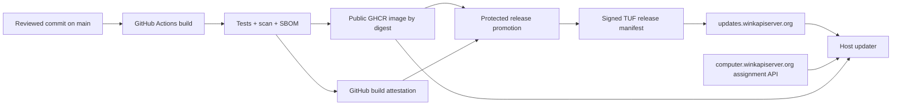

# Mini AIOS update source and release pipeline

Status: proposed after primary-source research
Companion design: [updater-system.md](./updater-system.md)
Host-updater contract: [host-updater.md](./host-updater.md)
Repository: `github.com/mahithsc/mini-aios`

## 1. Recommendation

Use four deliberately separate sources:

| Responsibility | Recommended source | Trust level |
|---|---|---|
| Source code | `github.com/mahithsc/mini-aios` | Input to the build, not directly trusted by devices |
| Image bytes | `ghcr.io/mahithsc/mini-aios@sha256:<digest>` | Untrusted transport; digest is verified |
| Release authorization | `https://updates.winkapiserver.org/tuf/` | Trusted only after TUF signature verification |
| Device rollout assignment | `https://computer.winkapiserver.org/v1/device-updates/assignment` | Authenticated policy/eligibility signal, not release trust |

In plain terms, updates originate from a reviewed Git commit, are built once by GitHub Actions, stored in GitHub Container Registry (GHCR), authorized by signed TUF metadata, and offered gradually by the AIOS control plane.



The device installs only when the assignment, signed manifest, immutable image digest, local channel, architecture, database compatibility, and monotonic sequence all agree.

## 2. Why these sources

### GitHub is the source-of-truth

The current Git remote is `https://github.com/mahithsc/mini-aios.git`, and the repository is public. Releases should be tied to an exact commit on the protected `main` branch. A device never runs `git pull`: source checkouts contain mutable files, development state, and no atomic activation/rollback boundary.

### GHCR serves the image bytes

GHCR is the natural registry because GitHub Actions can publish with the workflow-scoped `GITHUB_TOKEN`, and GitHub documents both OCI support and pulls by exact digest. Build one multi-platform image index covering `linux/amd64` and `linux/arm64`.

Make the container package public. This is the right default here because:

- the source repository is already public, so the container layers do not provide meaningful source confidentiality;
- GitHub supports anonymous pulls of public container images; and
- private GHCR clients currently authenticate with personal access tokens (classic), which is a poor fleet credential to copy onto every appliance.

Public availability does not authorize installation. TUF metadata and the digest provide that boundary. If the product later includes proprietary code, move images to a registry that can mint short-lived, per-device pull tokens; do not solve that change by distributing one shared GitHub PAT.

### TUF authorizes releases

The registry answers “where are the bytes?” It should not answer “which bytes may run?” A public or compromised registry must not be able to select a release.

The Update Framework (TUF) provides signed roles, thresholds, versioned metadata, expiry, consistent snapshots, and client workflows that defend against rollback, freeze, and mix-and-match attacks. Store the release manifest from this repository as a TUF target. The manifest contains the GHCR repository and digest; the image itself remains in GHCR.

Use `tuf-on-ci` to create and maintain the repository rather than implementing signing and metadata publication from scratch. Use `go-tuf/v2` in the proposed Go host updater.

### The control plane schedules, but does not sign, normal releases

`computer.winkapiserver.org` already serves the box's cloud pairing and relay flow. Add the assignment and event APIs there. It decides whether a device is in the current rollout cohort, maintenance window, and channel.

Compromise of the assignment service could prematurely offer an already authorized release or withhold updates, but it cannot authorize a new image digest. Keeping the TUF signing path separate from the runtime control plane limits the control plane's update authority.

## 3. Concrete release identities

Use four identifiers with different purposes:

| Identifier | Example | Purpose |
|---|---|---|
| Git tag | `v0.2.0` | Human release name and source commit |
| Release ID | `2026.08.10.1` | Globally unique release record |
| Sequence | `43` | Monotonic anti-rollback comparison |
| OCI digest | `sha256:…` | Immutable identity of image contents/index |

Semantic versions are allowed to branch or contain prerelease labels, so devices must use `sequence`, not semantic-version ordering, for rollback protection.

Human-readable tags may point at the same image:

```text
ghcr.io/mahithsc/mini-aios:0.2.0
ghcr.io/mahithsc/mini-aios:stable
```

Devices never install those tag references. They install:

```text
ghcr.io/mahithsc/mini-aios@sha256:<multi-platform-index-digest>
```

The signed manifest maps each architecture to an artifact digest. Prefer one multi-platform index digest when the installed Docker version reliably selects the correct platform; retain per-platform digests in release evidence for diagnosis.

## 4. Build and promotion pipeline

Build and promotion are separate workflows. Promotion never rebuilds the image.

### 4.1 Pull-request and main-branch CI

Every pull request and protected-branch push runs:

1. formatting and static checks;
2. Python unit and integration tests;
3. database migration tests from every supported schema;
4. rollback-compatibility tests against the previous stable image;
5. container build without publishing;
6. dependency and container vulnerability scanning; and
7. secret scanning.

Require these checks and at least one review before merging to `main`. Disallow force-pushes and direct pushes to `main`.

### 4.2 Candidate build

An annotated tag matching `v*` starts `.github/workflows/build-release.yml`.

The job:

1. checks out the exact tag commit;
2. verifies the tag commit is reachable from protected `main`;
3. reads the version from `pyproject.toml` and requires it to equal the tag;
4. builds `linux/amd64` and `linux/arm64` with Buildx;
5. adds OCI and Mini AIOS release labels;
6. pushes the candidate to `ghcr.io/mahithsc/mini-aios` with `GITHUB_TOKEN`;
7. captures the registry-returned digest;
8. generates an SPDX SBOM;
9. creates a GitHub artifact attestation for the digest; and
10. uploads a release-evidence bundle containing test results, commit, digest, platforms, SBOM digest, and migration test report.

The workflow receives only:

```yaml
permissions:
  contents: read
  packages: write
  attestations: write
  id-token: write
```

Pin every third-party action to a full commit SHA. Do not grant this unapproved build job access to TUF release-signing credentials.

### 4.3 Stable promotion

A separate `.github/workflows/promote-release.yml` is started manually with a candidate release ID. The job references a protected GitHub environment named `stable-release`.

Configure that environment to:

- require a reviewer who did not start the promotion;
- prevent self-review and administrator bypass where the GitHub plan permits it;
- allow only version tags from the protected repository; and
- expose release-publication credentials only after approval.

Promotion performs verification before publication:

1. resolve the candidate to an OCI digest;
2. verify its GitHub artifact attestation belongs to `mahithsc/mini-aios` and the expected workflow/tag commit;
3. verify the image labels, architectures, SBOM, scan result, and release evidence;
4. allocate the next sequence from an append-only release ledger;
5. generate `releases/stable/<sequence>.json` using the checked-in JSON Schema;
6. open or merge the `tuf-on-ci` signing event for the `stable` delegated role;
7. publish the complete, consistent TUF repository; and
8. create/update the GitHub Release with the release notes, digest, SBOM, and rollout status.

After TUF publication is observable from two independent fetches, register the release with the assignment service at 0% rollout. Promotion and rollout are distinct operations.

## 5. Signing model

Use separate keys for separate failure domains.

| TUF role | Recommended key policy | Expiry | Operation |
|---|---|---:|---|
| Root | 2-of-3 offline hardware keys held by different maintainers | 1 year | Rotation/delegation only |
| Top-level targets | 2-of-3 offline hardware keys | 6 months | Delegate `dev`, `beta`, `stable` |
| Stable delegated targets | 1 online KMS/Sigstore signer behind protected release approval | 30 days | Each stable release |
| Beta/dev delegated targets | Separate online signer | 14 days | Faster release cadence |
| Snapshot | Separate online signer | 7 days | Repository consistency |
| Timestamp | Separate online signer | 24 hours | Automated refresh |

These are starting values, not TUF requirements. They intentionally make a timestamp-service outage stop new installations after 24 hours while leaving already installed software running.

Bootstrap each appliance with the same trusted TUF `root.json` embedded in the updater binary and also installed root-owned on disk. Root rotation follows TUF's sequential root-update process. The updater persists the newest trusted metadata outside the AIOS application volume.

The stable signing identity should be inaccessible to pull-request workflows. If Sigstore keyless signing is used through `tuf-on-ci`, constrain the accepted GitHub OIDC identity to the immutable repository identity and the exact protected promotion workflow/environment. If a cloud KMS is used, GitHub OIDC should exchange for a short-lived token instead of storing a cloud access key in GitHub.

## 6. TUF repository hosting

Recommended production URL:

```text
https://updates.winkapiserver.org/tuf/
```

Store the repository in a dedicated Cloudflare R2 bucket and serve it through a Worker bound to that bucket. The Worker is only a transport layer; clients verify all TUF metadata and targets.

Proposed layout:

```text
/tuf/metadata/1.root.json
/tuf/metadata/2.root.json
/tuf/metadata/timestamp.json
/tuf/metadata/<version>.snapshot.json
/tuf/metadata/<version>.targets.json
/tuf/metadata/<version>.stable.json
/tuf/targets/releases/stable/<sha256>.43.json
```

Enable TUF consistent snapshots. Publish all new versioned metadata and targets first, then publish `timestamp.json` last. Never delete historical root metadata while supported devices may need it for sequential key rotation.

Apply path-specific caching:

| Path | Cache policy |
|---|---|
| `timestamp.json` | `Cache-Control: no-store` |
| unversioned mutable metadata | `Cache-Control: no-cache` |
| versioned metadata and hash-prefixed targets | `Cache-Control: public, max-age=31536000, immutable` |
| missing metadata/targets | do not edge-cache 404 responses |

Cloudflare documents that cached overwritten objects and 404s may remain stale. The combination of immutable names, timestamp-last publication, consistent snapshots, and the above cache policy prevents cache races from becoming a normal rollout problem. TUF verification still fails closed if a mirror serves inconsistent data.

R2 write credentials are restricted to this bucket and only the protected publication job. A stolen R2 credential can corrupt or withhold hosted files but cannot create valid TUF signatures. Publication keeps a versioned copy of every repository generation for disaster recovery.

For a very small MVP, GitHub Pages can host the static TUF repository. R2 plus a Worker is the production recommendation because it provides a product-owned domain and explicit cache behavior.

## 7. Assignment service

The assignment service stores release records imported from the published, signed manifest:

```text
release_id
sequence
channel
tuf_target_path
status                 # draft, canary, active, paused, revoked
rollout_basis_points   # 0..10000
not_before
deadline
minimum_device_version
created_at
```

Device cohorts are stable:

```text
cohort = HMAC(rollout_secret, device_id) mod 10000
eligible = cohort < rollout_basis_points
```

The device authenticates using a dedicated update credential derived during pairing, not its local LAN token and not a registry token. The response contains only the selected TUF target path and timing policy. The device still checks that:

- the target is valid under its locally trusted TUF root;
- target channel equals its enrolled channel;
- sequence exceeds its last committed sequence;
- architecture and database schema are compatible; and
- the assignment remains eligible immediately before activation.

The API may return no assignment during an outage or rollout pause. The updater keeps running the installed version indefinitely; inability to check for an update never stops AIOS.

## 8. Revocation and emergency rollback

Stopping a bad release has three steps:

1. set assignment status to `paused` so no new device begins activation;
2. publish new TUF metadata removing/revoking the bad target; and
3. publish a replacement release after investigation.

Devices recheck assignment and TUF metadata immediately before activation, so a downloaded but not activated release can be stopped.

Do not instruct devices to lower their stored sequence for an emergency rollback. Publish a new emergency release with a higher sequence that points to the last-known-good image digest and declares the database restore/compatibility policy. For example, release sequence 44 may intentionally reuse the application image from sequence 42 while remaining a new, authorized recovery action.

Keep every image digest referenced by a supported release or rollback window. A human-friendly GitHub Release or tag may be removed, but deleting the underlying GHCR manifest can strand devices that need recovery.

## 9. Credential inventory

| Credential | Stored where | Scope |
|---|---|---|
| GitHub workflow `GITHUB_TOKEN` | Ephemeral in Actions | Publish package/attestation for this repository |
| TUF root private keys | Offline hardware keys | Root metadata only |
| Stable targets signer | KMS or keyless CI identity | Stable delegated role only |
| Snapshot signer | Online signing service | Snapshot metadata only |
| Timestamp signer | Online signing service | Timestamp metadata only |
| R2 publisher token | Protected release environment | Write one update bucket |
| Device update token | Host updater root-owned state | Assignment/events for one device |
| Registry pull token | None for public GHCR | Anonymous digest pull |

No release credential, GitHub token, TUF signing key, R2 token, or Docker credential is mounted into the AIOS application container.

## 10. Threat-boundary check

| Compromise | Attacker can | Attacker cannot |
|---|---|---|
| GHCR | delete/withhold images, causing update failure | substitute bytes for a signed digest |
| R2/Worker | serve stale, missing, or corrupt metadata | create a valid authorized release |
| Assignment API | pause or accelerate an already signed rollout | authorize an unsigned digest |
| AIOS app/agent | affect application data available to that process | access Docker, updater socket, or release keys |
| Candidate build workflow | publish an unpromoted image | add it to stable TUF metadata |
| Stable online targets key | sign within its delegated channel | rotate the root or authorize other delegated paths |
| One offline root key | participate in root signing | meet the 2-of-3 root threshold alone |

No architecture prevents an authorized maintainer from approving malicious code. Branch protection, release review, independent key custody, provenance, audit logs, and reproducible/reviewable release evidence reduce that organizational risk.

## 11. Implementation order

1. Make the GHCR package public and reserve `ghcr.io/mahithsc/mini-aios`.
2. Add protected `main`, required CI, and `stable-release` environment rules.
3. Add a multi-platform candidate-build workflow with digest output, SBOM, and GitHub attestation.
4. Create a separate TUF repository from the `tuf-on-ci` template and perform the offline root ceremony.
5. Provision `updates.winkapiserver.org`, its R2 bucket, Worker, and path-specific cache rules.
6. Add the protected promotion workflow that verifies, generates, signs, and publishes the checked-in manifest format.
7. Add assignment and event endpoints to the AIOS cloud.
8. Implement the host updater with `go-tuf/v2` and an anonymous GHCR digest pull.
9. Run a manual-device channel, then internal, 1%, 10%, 50%, and 100% rollout drills.

## 12. Go/no-go checks for the source pipeline

A release source is production-ready only when:

- a device rejects a different image under the same human-readable tag;
- a public user can pull the image but cannot make a device install it;
- a compromised assignment response cannot select an unsigned digest or lower sequence;
- a stale R2 edge response either verifies safely or fails closed;
- a build from a fork, another repository, or another workflow fails provenance policy;
- the candidate workflow cannot access stable signing authority;
- one lost root key does not prevent rotation, and one compromised root key cannot rotate trust;
- a bad release can be paused before the next polling interval and recovered with a higher-sequence release; and
- deleting the active GitHub tag does not break devices already pinned to the digest.

## 13. Research basis

Primary references consulted:

- [GitHub: Publishing Docker images](https://docs.github.com/en/actions/tutorials/publish-packages/publish-docker-images) — GHCR publication with `GITHUB_TOKEN`, official Docker actions, and artifact attestations.
- [GitHub: Working with the Container registry](https://docs.github.com/en/packages/working-with-a-github-packages-registry/working-with-the-container-registry) — OCI support, anonymous public pulls, private-client PAT requirements, and digest pulls.
- [GitHub: Artifact attestations](https://docs.github.com/en/actions/concepts/security/artifact-attestations) — provenance purpose and policy limitations.
- [GitHub: Deployment environments](https://docs.github.com/en/actions/concepts/workflows-and-actions/deployment-environments) — reviewer, branch, and secret gates for promotion.
- [GitHub: OpenID Connect in cloud providers](https://docs.github.com/en/actions/how-tos/secure-your-work/security-harden-deployments/oidc-in-cloud-providers) — short-lived cloud credentials and trust conditions.
- [Docker: Multi-platform builds](https://docs.docker.com/build/building/multi-platform/) — multi-architecture image construction.
- [TUF: Roles and metadata](https://theupdateframework.io/docs/metadata/) — root, targets, snapshot, timestamp, expiry, and threshold roles.
- [TUF specification](https://theupdateframework.github.io/specification/latest/) — client verification and consistent snapshot requirements.
- [`tuf-on-ci`](https://github.com/theupdateframework/tuf-on-ci) — CI-based TUF repository maintenance, hardware/keyless signing, and threshold workflows.
- [`go-tuf/v2`](https://github.com/theupdateframework/go-tuf) — maintained Go client and metadata implementation.
- [Cloudflare R2 public buckets](https://developers.cloudflare.com/r2/buckets/public-buckets/) — production custom domains and cache support.
- [Cloudflare R2 consistency](https://developers.cloudflare.com/r2/reference/consistency/) — stale overwrite and cached-404 behavior that informs immutable path and cache policy.
