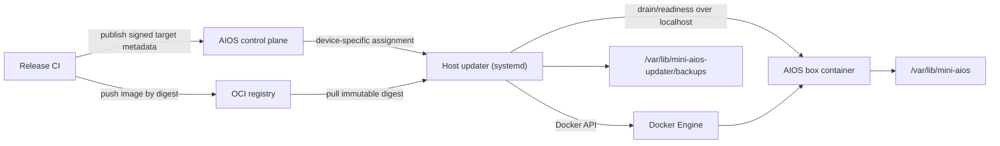
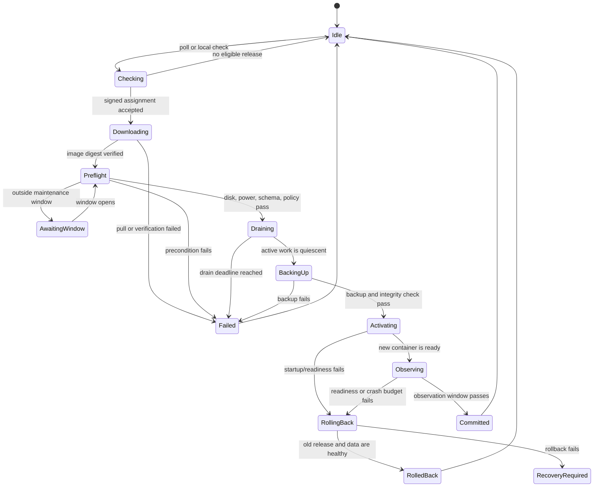

# Mini AIOS updater system

Status: proposed
Target: Mini AIOS appliances running the `box` service with Docker Compose
Primary goals: unattended updates, release authenticity, preservation of user data, and automatic recovery from a bad release

Release-source companion: [update-source-and-release-design.md](./update-source-and-release-design.md)

Host-updater contract: [host-updater.md](./host-updater.md)

Working implementation and Mac demo: [updater-implementation.md](./updater-implementation.md)

## 1. Decision summary

Run updates from a small host-level service named `mini-aios-updater`. Do not put update logic in the AIOS application container.

The updater:

1. polls the control plane for a device-specific release assignment;
2. verifies signed release metadata and an immutable OCI image digest;
3. downloads the image without disrupting the running service;
4. drains AIOS and takes a consistent SQLite backup;
5. starts the new image against the persistent runtime volume;
6. commits only after readiness and a short observation window pass; and
7. otherwise restores the database backup and starts the previous image.

The first implementation should be a single static Go binary installed as a `systemd` service on the appliance. It is intentionally independent of the Python environment, application image, and runtime volume that it updates. Publish updater binaries for `linux/amd64` and `linux/arm64`.

## 2. Existing-system constraints

The current repository already has several useful boundaries:

- production data lives below `~/.mini-aios`;
- `state/aios.db`, projects, session scratch files, uploads, artifacts, runs,
  skills, memories, and deployments are separate from application code;
- `/health` provides a basic liveness check;
- the box is packaged as a Docker image and run with Docker Compose;
- device identity and pairing credentials survive container restarts in SQLite.

The updater must also account for these risks:

- `initialize_app_db()` currently performs schema changes during application startup;
- the current Compose file builds from a local checkout instead of running an immutable published image;
- the named `aios-data` volume is harder for a host service to inspect and back up safely than an explicit host path;
- stopping the service during a streamed run can interrupt user work;
- a compromised agent process must not be able to command Docker or select an arbitrary update image.

## 3. Architecture



### Components

**Release CI**

- builds a multi-architecture image;
- runs unit, integration, migration, and downgrade-compatibility tests;
- emits an SBOM and provenance attestation;
- scans the final image;
- pushes the image and records its `sha256` digest; and
- publishes signed release metadata only after all gates pass.

**Control plane**

- assigns a release by device, channel, architecture, and rollout cohort;
- supports pause, resume, and revocation;
- records update events and fleet health; and
- never sends shell commands or mutable image tags to the updater.

**Host updater**

- is the only component with access to Docker;
- keeps an append-only local update journal;
- verifies metadata independently of HTTPS;
- enforces monotonic release sequence numbers;
- owns the update lock, backup, activation, health gate, and rollback; and
- can update itself through a separate, infrequent package flow.

**AIOS box container**

- reports liveness, readiness, version, and database schema version;
- can enter a drain state and reject new runs while finishing active ones; and
- has no Docker socket, registry credentials, signing keys, or updater state mounted into it.

## 4. Host layout

Use explicit host paths in production:

```text
/opt/mini-aios/
  compose.yaml                 # installed, root-owned
  release.env                  # active image digest and release metadata
/var/lib/mini-aios/
  state/
    aios.db
  projects/<project-id>/
  sessions/<chat-id>/scratch/
  uploads/<chat-id>/
  artifacts/<chat-id>/
  runs/
  skills/
  memories/
  deployments/
/var/lib/mini-aios-updater/
  state.json                   # durable updater state
  update.lock                  # single-update lock
  journal.jsonl                # transition and error events
  metadata/                    # trusted metadata cache
  backups/<release-id>/aios.db
  backups/<release-id>/backup.json
/etc/mini-aios/updater.toml     # endpoint, channel, timing, trusted root
/usr/local/bin/mini-aios-updater
```

`/var/lib/mini-aios` replaces the production named volume. It is mounted at
`/root/.mini-aios` in the box container and therefore implements the
production [`~/.mini-aios` storage contract](./storage-layout.md). Ownership is
fixed at installation and validated before every update. The updater refuses
to operate if any resolved path escapes the configured roots.

`release.env` contains an immutable reference:

```dotenv
AIOS_IMAGE=ghcr.io/mahithsc/mini-aios@sha256:0123456789abcdef...
AIOS_RELEASE_ID=2026.08.10.1
```

Compose uses `image: ${AIOS_IMAGE}` and never uses `build:` on an appliance.

## 5. Trust and release metadata

Use The Update Framework (TUF) metadata for production. TUF supplies signed targets, key rotation, expiry, rollback protection, and protection against a frozen update feed. HTTPS remains required, but is not the root of release trust. The concrete source pipeline uses the public repository at `github.com/mahithsc/mini-aios`, public image bytes at `ghcr.io/mahithsc/mini-aios`, signed metadata at `updates.trywink.io`, and rollout assignments from `computer.trywink.io`.

The trusted TUF root is installed with the appliance image. Root-key changes require the normal TUF threshold/rotation process. Online release automation signs delegated channel targets; offline root keys do not live in CI.

Each target's custom metadata follows [`update-manifest.schema.json`](./schemas/update-manifest.schema.json). Important fields are:

- a monotonically increasing `sequence` independent of semantic version parsing;
- an immutable OCI repository plus digest for each supported architecture;
- a minimum updater version;
- database migration and rollback compatibility;
- rollout channel and observation timing; and
- optional critical-update and deadline flags.

The updater accepts a release only when all of the following hold:

1. the TUF chain and expiry are valid;
2. product, channel, OS, and architecture match the device;
3. `sequence` is greater than the last committed sequence, unless an operator uses the physical/local break-glass procedure;
4. the updater satisfies `minimumUpdaterVersion`;
5. the pulled image's registry digest equals the signed target digest; and
6. the declared database compatibility includes the device's current schema.

Never accept a release solely because a tag such as `latest` or `stable` changed.

## 6. Assignment protocol

The device polls with randomized jitter rather than receiving an update command through the AIOS agent or relay.

```http
GET /v1/device-updates/assignment?channel=stable&currentSequence=42&arch=arm64
Authorization: Bearer <device-update-token>
```

The server returns `204 No Content` or a small assignment:

```json
{
  "releaseId": "2026.08.10.1",
  "tufTarget": "releases/stable/2026.08.10.1.json",
  "cohort": 7,
  "notBefore": "2026-08-10T20:00:00Z"
}
```

The assignment is not trusted release metadata; it only points the updater at a signed TUF target. The control plane may withhold an assignment based on cohort, but it cannot make the updater install an unsigned release.

Report transitions to:

```http
POST /v1/device-updates/events
Authorization: Bearer <device-update-token>
Idempotency-Key: <device-id>:<release-id>:<state>:<attempt>
```

Events include timestamps, from/to versions, state, duration, health result, and a bounded/scrubbed error code. They must not include environment values, prompts, tokens, user files, or chat content. Events are queued locally when offline.

## 7. Update state machine



Persist the state before performing the corresponding side effect. Every transition is idempotent so an unexpected reboot can resume safely. On service startup:

- `Downloading` or `Preflight` resumes with the old app still active;
- `Draining` or `BackingUp` verifies the old app and either continues or cancels;
- `Activating` or `Observing` health-checks the selected release and commits or rolls back;
- `RollingBack` continues rollback before accepting another assignment.

Only one update may run at a time. Use a kernel file lock in addition to persisted state.

## 8. Update transaction

### 8.1 Check and download

1. Refresh TUF metadata and request an assignment.
2. Validate release policy and monotonic sequence.
3. Confirm enough free disk for the image, one database backup, and a safety margin.
4. Pull the exact OCI digest while the old container continues serving traffic.
5. Inspect the local image and confirm its `RepoDigest`, platform, and required labels.

Required image labels:

```text
io.mini-aios.release-id
io.mini-aios.version
io.mini-aios.sequence
io.mini-aios.db-schema
org.opencontainers.image.revision
```

### 8.2 Preflight and drain

Preflight fails closed when:

- trusted metadata is expired or unverifiable;
- the device is on battery below the configured threshold, when detectable;
- disk space is below the release size plus configured reserve;
- the database fails `PRAGMA quick_check`;
- migration compatibility is not declared;
- the updater is too old; or
- the previous update is not in a terminal state.

The updater calls a loopback-only administrative endpoint to enter drain mode. In drain mode, AIOS:

- rejects new chat runs, cron starts, and app activations with `503` plus `Retry-After`;
- lets active work finish for up to the release's `drainTimeoutSeconds`;
- pauses cron scheduling without deleting schedules; and
- exposes the remaining active-run count.

Normal updates are postponed when the drain deadline expires. A critical release may force a graceful process stop only when its signed policy explicitly permits that behavior.

### 8.3 Backup

After the application is quiescent:

1. stop the old container cleanly;
2. use SQLite's online backup API from a trusted helper, or copy the database only after checkpointing WAL and confirming no process has it open;
3. run `PRAGMA integrity_check` on the backup;
4. write `backup.json` with source release, schema, SHA-256, size, and timestamp; and
5. fsync the backup file and parent directory before activation.

The updater normally backs up `state/aios.db`, not the entire data root. During
the one-time canonical-layout upgrade it first checks for the active legacy
`workspace/aios.db`; that path takes precedence over a stale `state/aios.db`
and is recorded in `backup.json`. Projects, session scratch files, uploads,
artifacts, skills, memories, and deployment data remain on the persistent host
path and are never deleted by an application update. A future release that
transforms filesystem state must declare and implement its own journaled
migration and backup plan.

Keep the last two successful pre-update database backups plus any backup referenced by a non-terminal update. Prune only after commit.

### 8.4 Activate and observe

1. atomically replace `release.env` using write, fsync, and rename;
2. run `docker compose up -d --no-build --no-deps box`;
3. require liveness within 30 seconds and readiness within 120 seconds by default;
4. verify reported release ID, sequence, image digest, and schema against signed metadata; and
5. observe for 5 minutes by default, failing if readiness drops, the container restarts, or the endpoint exceeds the configured consecutive-failure budget.

After the observation window, write the committed release and sequence to `state.json`, report success, remove drain mode, and retain the previous image until backup pruning.

### 8.5 Roll back

Rollback is allowed only according to the release's signed database policy.

- If startup failed before migration, restore `release.env` and restart the previous digest.
- If a migration ran and `restoreBackupOnRollback` is true, stop the new container, atomically restore the verified pre-update database, and restart the previous digest.
- If the pre-update backup came from `workspace/aios.db`, reverse the completed
  or in-progress `storage-layout-v1` journal and restore that database even
  when the schema is otherwise backward-compatible. A root-owned rollback
  cursor beside the backup makes each reversed action restartable after a
  power loss. This puts projects, session files, uploads, artifacts, and the
  database back where the previous release expects them.
- If the new schema is explicitly readable by the previous release, the backup need not be restored.
- If neither condition is true, do not loop between releases. Stop the service, enter `recovery_required`, and surface a local diagnostic.

Restoring the backup discards writes made after activation. The short observation window and drained state minimize this interval. The app should remain read-only until the updater commits a release that required a non-backward-compatible migration.

## 9. Application API changes

Keep the public `/health` response for compatibility and add loopback/admin endpoints protected by a dedicated updater token mounted as a file, not passed through agent-visible environment variables.

```text
GET  /internal/updater/live
GET  /internal/updater/ready
POST /internal/updater/drain
GET  /internal/updater/drain
POST /internal/updater/resume
```

Example readiness response:

```json
{
  "status": "ready",
  "releaseId": "2026.08.10.1",
  "version": "0.2.0",
  "sequence": 43,
  "imageDigest": "sha256:...",
  "databaseSchema": 3,
  "migrationState": "complete",
  "checks": {
    "database": "ok",
    "runtimeDirectories": "ok",
    "runWorkers": "ok"
  }
}
```

Readiness must not depend on optional external services such as an LLM provider, Gmail, DoorDash, Cloudflare Tunnel, or the AIOS cloud. An outage in one of those services must not trigger an application rollback.

The update token grants only drain/status/resume operations. It does not grant normal API access and must not be accepted by `/command` or gateway routes.

## 10. Database migration contract

Replace ad hoc `ALTER TABLE` calls at startup with ordered, transactional migrations:

```sql
CREATE TABLE schema_migrations (
    version       INTEGER PRIMARY KEY,
    name          TEXT NOT NULL,
    checksum      TEXT NOT NULL,
    applied_at    INTEGER NOT NULL,
    app_release   TEXT NOT NULL
);
```

Rules:

1. A released migration file is immutable; its checksum must continue to match.
2. Each migration runs in a transaction when SQLite permits it.
3. Migrations are forward-only in normal operation.
4. Prefer expand/contract changes: add nullable columns or new tables first, deploy compatible code, and remove old structures only in a later release.
5. Every release declares `fromSchema`, `toSchema`, `previousAppCanReadToSchema`, and `restoreBackupOnRollback`.
6. The container refuses startup when the database schema is newer than its declared maximum.
7. Destructive migrations require a backup, read-only observation, and explicit release approval.

The existing storage-layout migration also needs a versioned compatibility declaration. Updater rollback must never rerun a destructive legacy-storage cleanup against restored data.

## 11. Rollout policy

Use deterministic cohorts derived from `HMAC(rollout-secret, device-id) mod 10000`, so a device stays in the same cohort without exposing its raw ID.

Recommended stable rollout:

| Stage | Fleet | Minimum observation | Promotion gate |
|---|---:|---:|---|
| Internal | staff devices | 2 hours | no recovery-required events |
| Canary | 1% | 6 hours | success >= 99%, rollback < 0.5% |
| Early | 10% | 12 hours | success >= 99.5%, crash rate not regressed |
| Broad | 50% | 24 hours | all SLOs healthy |
| Complete | 100% | ongoing | automatic pause remains active |

The control plane automatically pauses promotion on elevated rollback, boot failure, or recovery-required rates. Already downloaded releases do not activate after a pause unless the signed assignment remains eligible at activation time.

Channels:

- `dev`: manual devices, fast cadence;
- `beta`: opt-in users, shorter stage windows;
- `stable`: default, staged rollout; and
- `pinned`: no feature updates, but signed critical security updates may override only according to enrollment policy.

Add 0-30 minutes of poll jitter and a configurable local maintenance window. Security releases may carry a signed deadline, but still require valid power, disk, backup, and integrity checks.

## 12. Local operations

The updater exposes no network listener. A root-only CLI talks to its Unix socket:

```text
mini-aios-updater status
mini-aios-updater check
mini-aios-updater bootstrap
mini-aios-updater install <release-id>
mini-aios-updater rollback
mini-aios-updater doctor
```

`install` may select only a valid signed release. `rollback` may select only the locally recorded previous release and must obey schema compatibility. A physical/local break-glass downgrade requires an explicit flag and interactive confirmation; it is logged and never available through the AIOS agent API.

`doctor` checks trusted-metadata freshness, clock sanity, registry access, Docker health, disk capacity, permissions, database integrity, active/previous digests, and unfinished state-machine work. It redacts tokens and user data.

## 13. Failure behavior

| Failure | Behavior |
|---|---|
| Control plane unavailable | Keep current release; retry with bounded exponential backoff and jitter |
| Registry unavailable | Keep serving; retain assignment and retry later |
| Invalid/expired signature | Reject release, emit security event, do not retry tightly |
| Insufficient disk | Prune unreferenced images/backups within policy, then postpone |
| Drain timeout | Resume old release and postpone, unless signed critical policy allows stop |
| Backup/integrity failure | Abort before activation |
| New container fails readiness | Restore compatible data and previous digest |
| Reboot during activation | Resume from durable state and health-check selected release |
| Previous release also unhealthy | Enter recovery-required; never alternate indefinitely |
| Clock far outside trusted metadata window | Keep current release and require time synchronization/local repair |

An update failure must never unpair the box, delete projects, scratch files,
uploads, artifacts, or memories, reset skills, or erase queued crons.

## 14. Security requirements

- The app container never mounts `/var/run/docker.sock`.
- Updater files, trusted roots, Compose configuration, and Unix socket are root-owned and not writable by the AIOS runtime user.
- Registry pulls use read-only credentials scoped to the image repository.
- The updater validates canonical paths and rejects symlinks for backup/restore targets.
- Release selection comes only from signed metadata; control-plane authentication alone is insufficient.
- Sequence monotonicity is stored outside the AIOS volume so restoring application data cannot enable a release rollback attack.
- Update logs are size-bounded, structured, secret-redacted, and exclude user content.
- CI publishes SBOM and provenance attestations and blocks known critical vulnerabilities unless an audited exception is attached to the release.
- The host firewall does not expose updater endpoints. Internal app updater routes bind to loopback or a private Compose network only.

## 15. Delivery plan

### Phase 1: make releases observable and migration-safe

- make `pyproject.toml` the single application-version source;
- add build-time release ID, sequence, revision, and digest labels;
- add `schema_migrations` and convert current inline migrations;
- add detailed internal liveness/readiness endpoints;
- add drain/resume behavior for runs and crons; and
- add upgrade and downgrade-compatibility tests using a copy of a previous-release database fixture.

### Phase 2: local transactional updater

- create the static updater binary and `systemd` unit;
- switch production Compose from `build:` to `${AIOS_IMAGE}`;
- move persistent production data to `/var/lib/mini-aios`;
- implement durable states, locking, pull, preflight, drain, backup, activation, observation, rollback, and `doctor`;
- test power loss at every state transition; and
- support manual installation from signed local metadata before adding fleet rollout.

### Phase 3: signed remote releases

- publish multi-architecture OCI images;
- deploy TUF repository and offline root-key ceremony;
- add device assignments and idempotent event ingestion;
- implement cohort rollout, automatic pause, revocation, and channel policy; and
- exercise expired metadata, key rotation, registry compromise, replay, and freeze scenarios.

### Phase 4: operations hardening

- add dashboards and alerts for success, rollback, recovery-required, duration, and fleet-version distribution;
- run canary and full rollback drills;
- add updater self-update packaging;
- document factory reset versus application rollback; and
- define backup retention and disk-pressure runbooks.

## 16. Acceptance criteria

The updater is ready for stable rollout when all are true:

1. User data and pairing survive a successful update and an automatic rollback.
2. An unsigned image, mutable-tag substitution, stale sequence, expired metadata, or wrong architecture is rejected.
3. Pulling and verifying an update causes no service interruption.
4. A failed drain or backup leaves the old release running.
5. Startup failure, readiness failure, and crash during observation restore the previous healthy release automatically.
6. A reboot at every persisted state converges to committed, rolled back, failed-before-activation, or recovery-required without a loop.
7. Database compatibility is checked before activation, and the old app never opens a schema newer than it supports.
8. The AIOS process and agent tools cannot reach Docker, updater credentials, trusted signing material, or the updater control socket.
9. Rollout can be paused globally within one poll interval, while currently healthy devices continue serving.
10. Update telemetry contains no tokens, prompts, chats, project or scratch
    paths, or file contents.

## 17. Deliberate non-goals

- Updating the host kernel, Docker Engine, bootloader, or operating system. Use the appliance OS's A/B or package update mechanism for those.
- Synchronizing or backing up the entire user data root to the cloud.
- Letting the AI agent decide whether, when, or from where to install a release.
- Supporting arbitrary third-party images or registries.
- Zero-downtime database migrations. A short, controlled drain is safer for a single-device SQLite appliance.
